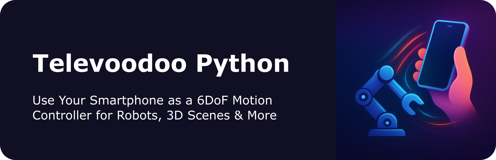

<p align="center">
  
</p>

**Televoodoo Python** enables your Python project to receive real-time **6DoF** pose data from any smartphone running the Televoodoo App — perfect for **Robot Teleoperation**, **3D object manipulation**, **VR motion control**, and more.

### The Televoodoo Ecosystem

- **[Televoodoo Python](https://github.com/Mana-Robotics/televoodoo-python)** (this project) — Receive 6DoF poses from the Televoodoo App via WiFi or BLE, with pose handling, coordinate transforms, and more
- **[Televoodoo App](mailto:hello@mana-robotics.com?subject=Televoodoo%20App%3A%20Request%20for%20Test%20Access)** (iOS, Android) — 6DoF tracking phone app that streams poses at low latency via WiFi or BLE
- **[Televoodoo Viewer](https://github.com/Mana-Robotics/televoodoo-viewer)** — Cross-platform desktop app for visual testing and config file creation 


## Quick Start

### Platform Notes

| Platform | WiFi (default) | BLE (optional) |
|----------|----------------|----------------|
| **macOS** | ✅ Works out of box | PyObjC frameworks (auto-installed) |
| **Ubuntu** | ✅ Works out of box | BlueZ: `sudo apt-get install libdbus-1-dev libglib2.0-dev python3-dev` |
| **Windows** | ✅ Works out of box | Not supported |
| **Other** | ✅ Works out of box | Not supported |


### 1. Install

#### Option A: Python venv (tested)

```bash
python3 -m venv .venv
source .venv/bin/activate
python -m pip install -U pip
pip install -r requirements.txt
pip install -e .
```

#### Option B: Conda

```bash
conda create -n televoodoo python -y
conda activate televoodoo
python -m pip install -U pip
pip install -r requirements.txt
pip install -e .
```

### 2. Run

**With CLI**

```bash
# Start with random credentials (QR code will be displayed)
televoodoo

# Start with static credentials
televoodoo --name myrobot --code ABC123
```

**Or as Python App**

```python
from televoodoo import start_televoodoo, PoseProvider, load_config

# Load config (optional - uses defaults if None)
config = load_config()
pose_provider = PoseProvider(config)

def my_pose_handler(evt):
    # For robot teleoperation, use get_delta():
    delta = pose_provider.get_delta(evt)
    if delta is None:
        return  # Not a pose event or no origin set yet
    
    if delta['movement_start']:
        print("New movement started — origin reset")
    print(f"Position delta: ({delta['dx']:.3f}, {delta['dy']:.3f}, {delta['dz']:.3f})")
    print(f"Rotation delta (rad): ({delta['rx']:.3f}, {delta['ry']:.3f}, {delta['rz']:.3f})")
    # Control your robot, 3D object, etc.

start_televoodoo(callback=my_pose_handler)
```

### 3. Connect with Televoodoo app (iOS, Android)

1. A QR code appears in your terminal
2. Use **Televoodoo App** to scan the QR code and the [ArUco marker](#coordinate-system-setup) (reference frame), then follow further on-screen instructions
5. Callback receives real-time 6DoF poses


## Physical Setup

### Coordinate System Setup

1. **Print the [ArUco marker](assets/televoodoo-aruco-marker.pdf)** (100% scale, no fit-to-page)
2. **Attach it** to your setup (e.g., somewhere statically linked to world/robot base) — this defines your reference frame
3. **Configure the transform** between marker and your world/robot frame with a config file. e.g. using [Televoodoo Viewer](https://github.com/Mana-Robotics/televoodoo-viewer)

> 💡 **Tip for robot teleoperation:** The position offset between marker and robot base doesn't matter — only the **axis orientation** of the reference frame relative to the robot base is crucial for correct motion mapping.

## Examples

Complete examples can be found in `examples/`:

| Example | Description |
|---------|-------------|
| `print_delta_poses/` | Print pose deltas — ideal for robot teleoperation |
| `print_poses/` | Print absolute poses |
| `poll_poses/` | Poll latest pose at a fixed rate |
| `measure_frequency/` | Measure pose input frequency |
| `record_poses/` | Record poses to a JSON file |
| `haptic_feedback/` | Send haptic feedback with simulated sensor values |
| `data_upsampling/` | High-frequency robot control with upsampled poses (200 Hz) |
| `data_rate_limiting/` | Rate-limited pose output (cap frequency) |


## Usage


### Option A: Using Pose Detltas

> ✅ **Recommended for Robot Teleoperation!** Deltas always start at 0 when tracking begins. Pause tracking, reposition yourself, then resume — no jumps in robot motion.


Use `PoseProvider.get_delta()` to get transformed deltas directly from events:

```python
from televoodoo import start_televoodoo, PoseProvider, load_config

# Load config (optional - uses defaults if None)
config = load_config("my_robot_config.json")
pose_provider = PoseProvider(config)

def my_handler(evt):
    # Get delta directly from event
    delta = pose_provider.get_delta(evt)
    if delta is None:
        return  # Not a pose event or no origin set yet
    
    # Access delta data for robot control
    print(f"Position delta: dx={delta['dx']:.3f} dy={delta['dy']:.3f} dz={delta['dz']:.3f}")
    print(f"Rotation delta (rad): rx={delta['rx']:.3f} ry={delta['ry']:.3f} rz={delta['rz']:.3f}")
    print(f"Rotation delta (quaternion): ({delta['dqx']:.3f}, {delta['dqy']:.3f}, {delta['dqz']:.3f}, {delta['dqw']:.3f})")
    
    # Send delta to robot
    # robot.move_relative(delta['dx'], delta['dy'], delta['dz'])

start_televoodoo(callback=my_handler)
```

The delta is calculated relative to the pose where `movement_start=True`, making it perfect for robot teleoperation where you want relative movements.

### Option B: Using Absolute Poses

> ⚠️ **Not recommended for robot teleoperation.** Absolute poses are non-zero from the start and will jump when tracking is paused and resumed.

Use `PoseProvider.get_absolute()` to get transformed absolute poses:

```python
from televoodoo import start_televoodoo, PoseProvider, load_config

# Load config (optional - uses defaults if None)
config = load_config("my_robot_config.json")
pose_provider = PoseProvider(config)

def my_handler(evt):
    # Get absolute pose from event
    pose = pose_provider.get_absolute(evt)
    if pose is None:
        return  # Not a pose event
    
    # Access pose data
    print(f"Position: x={pose['x']:.3f} y={pose['y']:.3f} z={pose['z']:.3f}")
    print(f"Quaternion: ({pose['qx']:.3f}, {pose['qy']:.3f}, {pose['qz']:.3f}, {pose['qw']:.3f})")

start_televoodoo(callback=my_handler)
```

### Pose Format

`PoseProvider.get_absolute()` returns a transformed pose:

```python
{
    "movement_start": True,  # New movement origin (for delta calculation)
    "x": 0.15,               # Position in meters (transformed)
    "y": 0.20,
    "z": -0.10,
    "qx": 0.01234,           # Quaternion (preferred for 3D math)
    "qy": -0.56789,
    "qz": 0.12345,
    "qw": 0.81234,
    "rx": 0.26,              # Rotation vector (radians) — always included
    "ry": -0.52,
    "rz": 0.09
}
```

| Field | Type | Description |
|-------|------|-------------|
| `movement_start` | bool | `True` = new origin for delta calculation (see below) |
| `x`, `y`, `z` | float | Position relative to ArUco marker (meters) |
| `qx`, `qy`, `qz`, `qw` | float | Quaternion — use this for robust 3D calculations |
| `rx`, `ry`, `rz` | float | Rotation vector (radians) — axis-angle representation |

> **Understanding `movement_start`**: When `true`, this pose becomes the new origin for calculating deltas. This allows you to reposition the phone/controller while not actively controlling, then start a new movement from a different physical position — the robot end effector stays in place and only applies relative deltas from the new origin.

### Authentication Credentials

Televoodoo provides 2 options for connection credentials:
- **Random** (default): New credentials each launch — good for quick testing  
- **Static**: Same credentials every time — good for ongoing projects, development, RL demonstration


**Random Credentials**

| Flag | Description | Default |
|------|-------------|---------|
| `--name` | Peripheral/server name | Random `voodooXX` |
| `--code` | 6-character auth code | Random alphanumeric |


**Static Credentials**

Option 1: Set via CLI flag
```bash
televoodoo --name myrobot --code ABC123
```

Option 2: Set in code
```python
from televoodoo import start_televoodoo

start_televoodoo(callback=handle_pose, name="myrobot", code="ABC123")
```

Option 3: Set within [config file](#config-files)

### Connection Types

You can specify the connection backend:

```python
start_televoodoo(
    callback=handle_pose,
    connection="auto"  # Options: "auto" (default), "wifi", "ble"
)
```

- **`"auto"`** (default): Uses WiFi — recommended for best latency and cross-platform compatibility
- **`"wifi"`**: UDP-based connection over local network (~60Hz consistent frequency / ~16ms latency)
- **`"ble"`**: Bluetooth Low Energy connection (platform-specific, subject to connection interval batching (e.g. iOS), resulting in effectively only ~30 Hz of update frequency / 32ms latency)

Or via CLI:

```bash
televoodoo --connection wifi   # WiFi (default)
televoodoo --connection ble    # Bluetooth
```

## Config Files

Config files define how poses are transformed from the ArUco marker frame to your target coordinate system (robot base, world frame, etc.), what output formats to include, and optionally BLE credentials.

### File Format & Location

- **Format**: JSON (`.json` extension recommended)
- **Default search paths** (in order):
  1. Current working directory
  2. Directory of your Python script
  3. Televoodoo module directory

### Config File Format

```json
{
  "authCredentials": {
    "name": "myrobot",
    "code": "ABC123"
  },
  "upsample_to_frequency_hz": 200.0,
  "rate_limit_frequency_hz": null,
  "includeFormats": {
    "absolute_input": true,
    "delta_input": false,
    "absolute_transformed": true,
    "delta_transformed": true
  },
  "includeOrientation": {
    "quaternion": true,
    "euler_radian": false,
    "euler_degree": true
  },
  "scale": 1.0,
  "outputAxes": {
    "x": 1,
    "y": 1,
    "z": -1
  },
  "targetFrameDegrees": {
    "x": 0.0,
    "y": 0.0,
    "z": 0.5,
    "x_rot_deg": 0,
    "y_rot_deg": 0,
    "z_rot_deg": 90
  }
}
```

| Section | Purpose |
|---------|---------|
| `authCredentials` | Connection credentials: `name` (peripheral name) and `code` (6-char auth code) |
| `includeFormats` | Which pose formats to output (raw input, deltas, transformed) |
| `includeOrientation` | Include quaternion, Euler radians, and/or Euler degrees |
| `scale` | Scale factor applied to positions |
| `outputAxes` | Axis multipliers (use `-1` to flip an axis) |
| `targetFrameDegrees` | 6DoF transform: marker → target frame (position in meters, rotation in degrees) |
| `upsample_to_frequency_hz` | Upsample poses to target frequency (Hz) using linear extrapolation |
| `rate_limit_frequency_hz` | Limit output to maximum frequency (Hz), drops excess poses |

### Creating Config Files

**Option 1: Use [Televoodoo Viewer](https://github.com/Mana-Robotics/televoodoo-viewer)** (recommended)
- Visually configure transforms with real-time 3D preview
- Export as JSON config file

**Option 2: Create manually**
- Copy the template above and adjust values

### Loading Config Files

```python
from televoodoo import load_config, PoseProvider, Pose, start_televoodoo

# Load config from file
config = load_config("my_robot_config.json")
pose_provider = PoseProvider(config)

def on_teleop_event(evt):
    # project specific callback code 
    # ...

# Use credentials from config (if specified), or fall back to random
start_televoodoo(
    callback=on_teleop_event,
    name=config.auth_name,  # None = random
    code=config.auth_code   # None = random
)
```


## Output Formats Explained

| Format | Description |
|--------|-------------|
| `absolute_input` | Raw pose from phone (in marker frame) |
| `delta_input` | Change since first pose (in marker frame) |
| `absolute_transformed` | Pose transformed to target frame |
| `delta_transformed` | Delta transformed to target frame — **best for robot control** |


## Advanced Topics

### Upsampling & Rate Limiting

Robot arm controllers often require higher frequency input (100-200 Hz) than the phone can provide (30-60 Hz via WiFi, ~30 Hz via BLE). Televoodoo can upsample pose data using linear extrapolation.

**Via CLI:**
```bash
televoodoo --upsample-hz 200          # Upsample to 200 Hz
televoodoo --rate-limit-hz 30         # Cap output at 30 Hz (no upsampling)
```

**Via Python:**
```python
from televoodoo import start_televoodoo, PoseProvider, load_config

config = load_config("my_robot_config.json")
pose_provider = PoseProvider(config)

def robot_handler(evt):
    """Called at ~200 Hz with real or extrapolated poses."""
    delta = pose_provider.get_delta(evt)
    if delta:
        robot.send_delta(delta['dx'], delta['dy'], delta['dz'])

# Just pass upsample_to_hz - resampling is handled internally
start_televoodoo(callback=robot_handler, upsample_to_hz=200.0, quiet=True)
```

**Via Config File:**
```json
{
  "upsample_to_frequency_hz": 200.0,
  "rate_limit_frequency_hz": 30.0
}
```

Then load and pass the config:
```python
config = load_config("my_robot_config.json")
start_televoodoo(callback=handler, config=config)
```

| Config Key | CLI Flag | Description |
|------------|----------|-------------|
| `upsample_to_frequency_hz` | `--upsample-hz` | Upsample to target frequency (Hz) using linear extrapolation |
| `rate_limit_frequency_hz` | `--rate-limit-hz` | Cap output at maximum frequency (Hz) |

**Key behaviors:**
- Real poses forwarded immediately (zero added latency)
- Extrapolated poses fill gaps using velocity-based prediction
- **Safety**: Extrapolation stops if no new pose arrives within expected interval (prevents runaway motion if phone disconnects)

> 💡 **Note:** Upsampling uses **regulated mode by default** for consistent timing at the target frequency. This outputs at fixed intervals with ~5ms max latency — ideal for robot controllers. Use `--no-regulated` if you prefer zero latency with irregular timing.

See `examples/data_upsampling/` for a complete example.

### Haptic Feedback

Send haptic feedback to the iOS app based on robot sensor values (e.g., force feedback).
The `send_haptic` function normalizes your sensor values to 0.0–1.0 intensity and transmits
them to the phone, which generates haptic vibrations accordingly.

```python
import threading
import time
from televoodoo import start_televoodoo, send_haptic, PoseProvider, load_config

# --- Force Monitoring Thread ---
# Runs independently to read robot force values and send haptic feedback

def force_monitor_loop():
    """Monitor robot force and send haptic feedback to the iOS app."""
    while True:
        force = robot.get_force()  # e.g., 0–50 Newtons
        # Normalize to 0.0–1.0 and send to iPhone
        send_haptic(force, min_value=0.0, max_value=50.0)
        time.sleep(0.05)  # 20 Hz update rate

# Start force monitoring in background thread
monitor_thread = threading.Thread(target=force_monitor_loop, daemon=True)
monitor_thread.start()

# --- Teleoperation Callback ---
# Receives poses from the iOS app

config = load_config("my_robot_config.json")
pose_provider = PoseProvider(config)

def on_teleop_event(evt):
    delta = pose_provider.get_delta(evt)
    if delta is None:
        return
    # Send delta to robot...
    robot.move_relative(delta['dx'], delta['dy'], delta['dz'])

# Start televoodoo (blocks until disconnected)
start_televoodoo(callback=on_teleop_event, quiet=True)
```

| Parameter | Type | Description |
|-----------|------|-------------|
| `value` | float | The sensor value to send (e.g., force in Newtons) |
| `min_value` | float | Minimum expected value (maps to intensity 0.0) |
| `max_value` | float | Maximum expected value (maps to intensity 1.0) |

The function is thread-safe and can be called from any thread while `start_televoodoo` is running.

### Quiet Mode

Suppress high-frequency logging (pose events, heartbeat) while still receiving callbacks:

```python
start_televoodoo(callback=handle_pose, quiet=True)
```


## Documentation

For in-depth technical details, see `docs/`:

- **[Pose Data Format](docs/POSE_DATA_FORMAT.md)** — Coordinate systems, field descriptions, validation
- **[Connection Setup](docs/CONNECTION_SETUP.md)** — QR codes, credentials, multi-device setup
- **[WiFi API](docs/WIFI_API.md)** — UDP protocol, mDNS discovery (default connection)
- **[BLE Peripheral API](docs/BLE_API.md)** — Service UUIDs, characteristics, protocol details


## Contributing

See [CONTRIBUTING.md](CONTRIBUTING.md) for development setup, BLE internals, and how to contribute.


## Maintainer

Developed with ❤️ for 🤖 by [Mana Robotics](https://www.mana-robotics.com).

## License

MIT License — see [LICENSE](LICENSE) for details.
